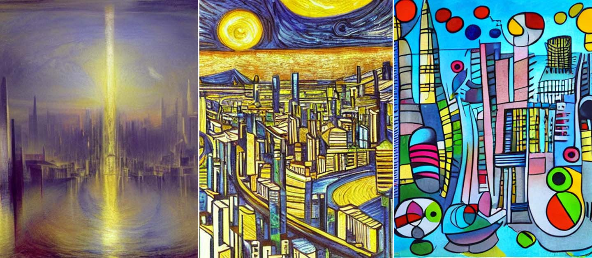

<picture>
  <source media="(prefers-color-scheme: dark)" srcset="https://user-images.githubusercontent.com/81682248/226963550-21eaaf59-ee3c-49a9-8e75-b76d740ddd09.png">
  
</picture>

# Stable Diffusion on IPUs

Stable Diffusion is one of the standout stars of the generative AI revolution. This alternative to Dall-E and Midjourney, is an open-source text-to-image model that has received widespread acclaim in the generative art scene for the quality and versatility of its images.

Run Stable Diffusion for yourself with Paperspace notebooks on Graphcore's IPU (Intelligence Processing Unit), a completely new kind of massively parallel processor designed to accelerate machine intelligence. Access advanced, cost-efficient IPU compute on demand in the cloud on Paperspace to build, fine-tune and deploy AI models such as Stable Diffusion.

## Stable Diffusion notebooks powered by IPUs

| Notebook | Framework | Type | Try for Free
| ------------- | ------------- | ------------- | ------------- |
| Text-to-Image Generation on IPU with Stable Diffusion - Inference | Hugging Face | Inference | 
| Text-to-Image Generation using Stable Diffusion 2 on IPU | Hugging Face | Inference | 
| Image-to-Image Generation on IPU using Stable Diffusion - Inference | Hugging Face | Inference | 
| Text Guided In-Painting on IPU using Stable Diffusion - Inference | Hugging Face | Inference | 

These notebooks demonstrate how you can run inference on Stable Diffusion models on Graphcore IPUs for the following tasks::
* text-to-image generation (Stable Diffusion v1.5 and Stable Diffusion v2)
* image-to-image generation
* text guided in-painting

## Stable Diffusion resources

* Hugging Face models
  * [runwayml/stable-diffusion-v1-5](https://huggingface.co/runwayml/stable-diffusion-v1-5)
  * [stabilityai/stable-diffusion-2](https://huggingface.co/stabilityai/stable-diffusion-2)
* [How-to walkthrough blog](https://www.graphcore.ai/posts/how-to-run-stable-diffusion-inference-on-ipus-with-paperspace)

To take your Stable Diffusion usage on IPUs further, or to speak to an expert, please feel free to [contact us](https://www.graphcore.ai/contact).

## IPU community

Join our growing community and interact with AI experts, IPU developers and researchers. Hear the latest IPU news and get access to our newest models.

## Licensing

The contents of this repository are made available according to the terms of the Apache 2.0 licence. See the included [LICENSE](LICENSE) file for details.

Some examples included in this repo are based on images from https://github.com/CompVis/latent-diffusion/.
